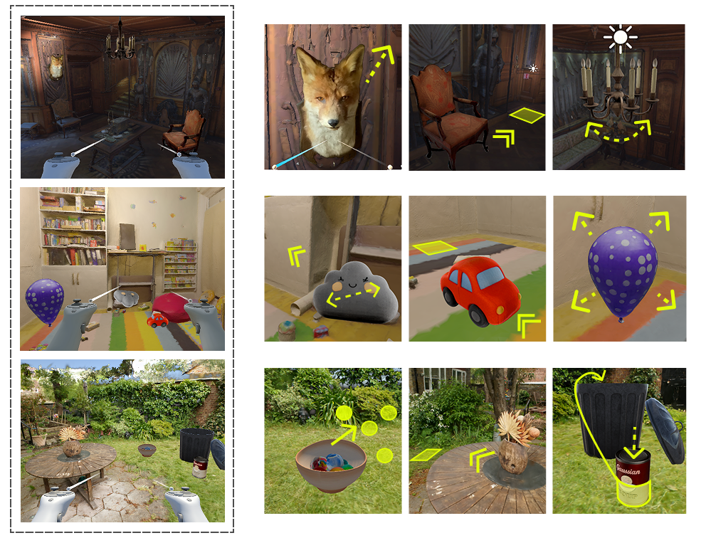
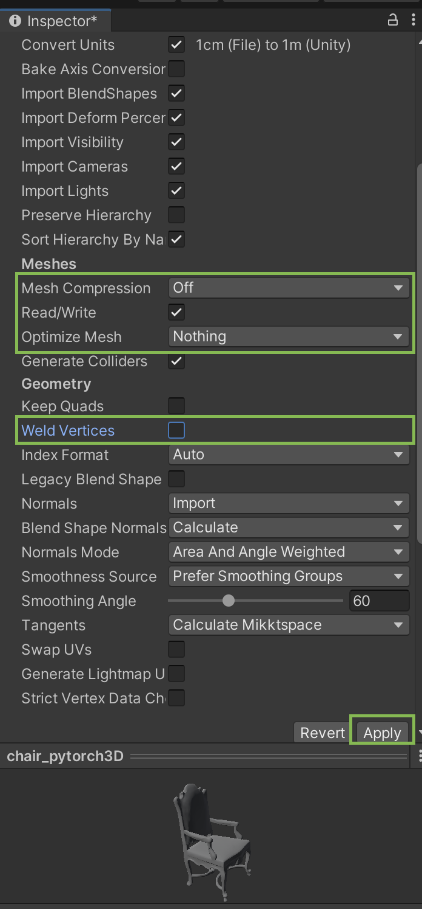
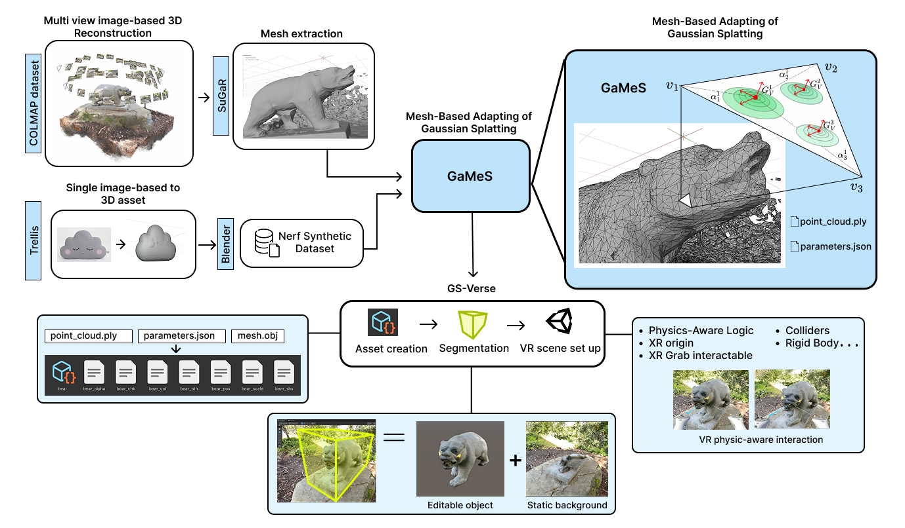
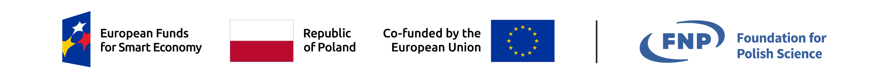

# GS-Verse  
[](https://arxiv.org/abs/2510.11878) [](https://drive.google.com/file/d/1W1AyAVohk6ITPe2Faz6F3SPZgpz2_edP/view?usp=sharing)


This repository hosts the **official implementation** of the paper:  
> **GS-Verse: Mesh-based Gaussian Splatting for Physics-aware Interaction in Virtual Reality**  
> _Authors_: Anastasiya Pechko, Piotr Borycki, Joanna Waczynska, Daniel Barczyk, Agata Szymańska, Sławomir Tadeja, Przemysław Spurek.  
> _2025_  


This project was developed based on an existing [Gaussian Splatting playground in Unity](https://github.com/aras-p/UnityGaussianSplatting).  
For detailed implementation notes and additional context, see the related [README](/projects/readme.md).


## Table of Contents

1. [Abstract](#abstract)  
2. [Prerequisites](#prerequisites)  
3. [Setup](#setup) 
4. [Asset creation](#asset-creation)
5. [Video tutorial (soon)](#video-tutorial)
6. [Segmenation & deformation tips (soon)](#segmentation-deformation)
7. [Acknowledgments](#license) 
8. [License](#license)  

## Abstract 

As the demand for immersive 3D content grows, the need for intuitive and efficient interaction methods becomes paramount. Current techniques for physically manipulating 3D content within Virtual Reality (VR) often face significant limitations, including reliance on engineering-intensive processes and simplified geometric representations, such as tetrahedral cages, which can compromise visual fidelity and physical accuracy. In this paper, we introduce GS-Verse (Gaussian Splatting for Virtual Environment Rendering and Scene Editing), a novel method designed to overcome these challenges by directly integrating an object's mesh with a Gaussian Splatting (GS) representation. Our approach enables more precise surface approximation, leading to highly realistic deformations and interactions. By leveraging existing 3D mesh assets, GS-Verse facilitates seamless content reuse and simplifies the development workflow.
Moreover, our system is designed to be physics-engine-agnostic, granting developers robust deployment flexibility. This versatile architecture delivers a highly realistic, adaptable, and intuitive approach to interactive 3D manipulation. We rigorously validate our method against the current state-of-the-art technique that couples VR with GS in a comparative user study involving 18 participants. Specifically, we demonstrate that our approach is statistically significantly better for physics-aware stretching manipulation and is also more consistent in other physics-based manipulations like twisting and shaking. Further evaluation across various interactions and scenes confirms that our method consistently delivers high and reliable performance, showing its potential as a plausible alternative to existing methods.



### Prerequisites

For detailed hardware and software requirements, please refer to the [original project README](/projects/readme.md).

This project was developed and tested using the following setup:

- **Unity version:** 2022.3.47  
- **Platforms:** macOS (Metal) / Windows 11 Home  
- **Headset:** Meta Quest Pro  

For the **user study**, the GS systems were deployed on a desktop PC equipped with:  
- **CPU:** Intel® Core™ i7-14700K (3.40 GHz)  
- **Memory:** 32 GB RAM  
- **GPU:** NVIDIA GeForce RTX 4070 SUPER  
- **Operating System:** Windows 11 Home  
- **CUDA Toolkit:** Version 12.4  
  *(Build V12.4.99, cuda_12.4.r12.4/compiler.33961263_0)*  

### Setup

```bash
# Clone or download this repository
git clone https://github.com/Anastasiya999/GS-Verse.git
cd GS-Verse
```
Open the project located at `projects/GaussianExample` in **Unity 2022.3** (other Unity 2022 versions may also work).

Since the Gaussian Splat models are quite large, they are **not included** in this GitHub repository.
To test the sample scenes, please download the assets from [this link](https://drive.google.com/file/d/1W1AyAVohk6ITPe2Faz6F3SPZgpz2_edP/view?usp=sharing). After downloading, place the contents as follows:

- Extract the contents of `RoomScenes/*` into `Assets/RoomScenes/`
- Place the `Resources` folder under `Assets/`

Your final directory structure should look like this:

```css
Assets/
 ├── RoomScenes/
 │    └── [scene content files]
 └── Resources/
      └── [resource files]
```
⚠️ **Important:**  
Unity performs mesh optimization and vertex modifications when importing `.obj` assets.
Our project relies on the **exact face order**, so please ensure that every asset from the `Resources` folder has the correct import settings in the **Unity Inspector**.  

If not, adjust the settings to match the configuration shown in the following screenshot and click **Apply**:  


To test the sample scene, open **`RoomScenes/darkRoom/364.unity`**.

- If you are using a **real device**, uncheck **XR Device Simulator** in the scene.  
- If you are using the **simulator**, use the following controller mappings:

  - **Stretch the fox** → Press `B` and move the mouse  
  - **Move the chair** → Press `G` and use the mouse to translate it  
  - **Swing the lamp** → Hover over the lamp with the controller ray and click the mouse to trigger the *Select* event

## Asset Creation

<div align="center">

</div>

Assets can be created in two ways depending on the available data — **a COLMAP dataset** or **a single reference image**.  
In both cases, we use **[GaMeS](https://github.com/waczjoan/gaussian-mesh-splatting)** to generate a mesh-parameterized Gaussian Splatting model.  
For installation and setup of GaMeS, please refer to its [README](https://github.com/waczjoan/gaussian-mesh-splatting#readme).

---

### Case I: COLMAP Dataset

If you already have a COLMAP dataset, you can generate a mesh using the **SuGaR** model.  
Please refer to the SuGaR [README](https://github.com/Anttwo/SuGaR?tab=readme-ov-file#sugar-surface-aligned-gaussian-splatting-for-efficient-3d-mesh-reconstruction-and-high-quality-mesh-rendering) for installation and usage details.  
Make sure to include the `--low_poly` argument for simplified geometry.

**Example command (for the SuGaR model):**
```bash
python train_full_pipeline.py \
  -s colmap_dataset \
  -r dn_consistency \
  --low_poly True \
  --export_obj True
```
Once you have generated `mesh.obj` using SuGaR, you can run the GaMeS model to extract mesh parameters.

Refer to **[Scenario I](https://github.com/waczjoan/gaussian-mesh-splatting?tab=readme-ov-file#scenario-i-mesh-initialized-input)** in the GaMeS documentation for details.

**Example command (for the GaMeS model)**:

```bash
python train.py \
  -s mesh_data \
  -m output/mesh_5splats_per_face \
  --gs_type gs_multi_mesh \
  --meshes mesh \
  --num_splats 5 \
  --vertices_lr 0 \
  -w
```
> **Note:**  
> The `mesh_data` folder should contain your COLMAP dataset.  
> Be sure to place the `mesh.obj` file inside `mesh_data/sparse/0`.

**Example Folder Structure**

```css
mesh_data/
 ├── images/
 │    └── [multiview images]
 ├── camera_paths/
 └── sparse/
      └── 0/
          └── mesh.obj
      ... 
```
Once you have trained your model, use the script `scripts/import_params.py` to extract parameters into a JSON file.
Simply run it in the same directory where your `model_params.pt` file is located. 

---

### Case II: TRELLIS (a single reference image)

If you have only a **single reference image** or want to generate a **text-to-image** asset, you can use the ([TRELLIS model](https://github.com/microsoft/TRELLIS?tab=readme-ov-file#structured-3d-latentsfor-scalable-and-versatile-3d-generation)).

Once you have obtained a **3D mesh**, you can use **Blender** to generate a NeRF Synthetic Dataset.
Please refer to [BlenderNeRF](https://github.com/maximeraafat/BlenderNeRF?tab=readme-ov-file#blendernerf) for setup and detailed instructions. 

Export the mesh from Blender in left-handed coordinate system, and use the generated NeRF Synthetic Dataset to prepare the input folder as described in **[Scenario I](https://github.com/waczjoan/gaussian-mesh-splatting?tab=readme-ov-file#scenario-i-mesh-initialized-input)**. 

> ⚠️ **Warning:**  
> We have noticed some inconsistencies between meshes obtained from **SuGaR** and **TRELLIS**.  
> To ensure uniformity, please re-export the **TRELLIS** mesh using the script:  
> `scripts/reexport_mesh.py`

Example command (for the GaMeS model):

```bash
python train.py --eval -s mesh_data -m output/mesh_5splats_per_face --gs_type gs_mesh --num_splats 5 -w
```
Once you have trained your model, use the script `scripts/import_params.py` to extract parameters into a JSON file as in Case I.

### Unity Asset Creation

To create an asset in **Unity**, you will need the following files obtained from the previous steps (**Case I** or **Case II**):

- `mesh.obj`  
- `point_cloud.ply`  
- `model_params.json`

**Steps:**

1. Open **Unity** → go to **Tools > Gaussian Splats > Create GaussianSplatAsset**.  
2. Set the **Processing Mode** to **GaMeS**.  
3. Check L-Handed Coordinate system if it was exported from Blender (Case II).
4. Provide references to your `point_cloud.ply` (*Input point cloud* field) and `model_params.json` (*Input json params file* field) files.  
5. Place your 3D mesh (`mesh.obj`) in the `Assets/Resources` folder and reference it by **name** in the *Path to obj* field.  
6. Choose your **Output Folder** and **Quality**.  
7. Click **Create Asset** to create your Unity-compatible model.

### Final Step: Create Your First GS Verse Asset

You’re almost done! 🎉  
Now you can create your first **GS Verse** asset.

1. In **Unity**, create a new **GameObject** in your scene.  
2. Add the **Gaussian Splatting Renderer** component to it.  
3. Assign the asset you created in the previous steps.


## Acknowledgments
The code was developed based on an existing [Gaussian Splatting playground in Unity](https://github.com/aras-p/UnityGaussianSplatting), [gaussian-splatting](https://github.com/graphdeco-inria/gaussian-splatting) (3D) and [GaMeS](https://github.com/waczjoan/gaussian-mesh-splatting).

The project “Effective rendering of 3D objects using Gaussian Splatting in an Augmented Reality environment” (FENG.02.02-IP.05-0114/23) is carried out within the First Team programme of the Foundation for Polish Science co-financed by the European Union under the European Funds for Smart Economy 2021-2027 (FENG).

<div align="center">

</div>

## Licence

Please refer to the [original project Licence](https://github.com/aras-p/UnityGaussianSplatting?tab=readme-ov-file#license-and-external-code-used)
